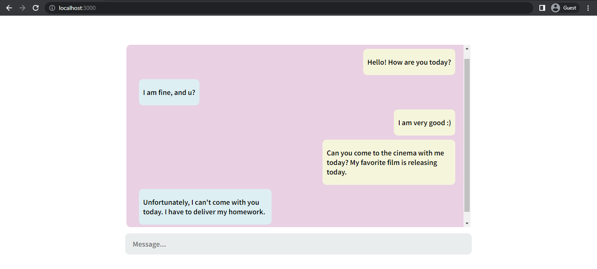
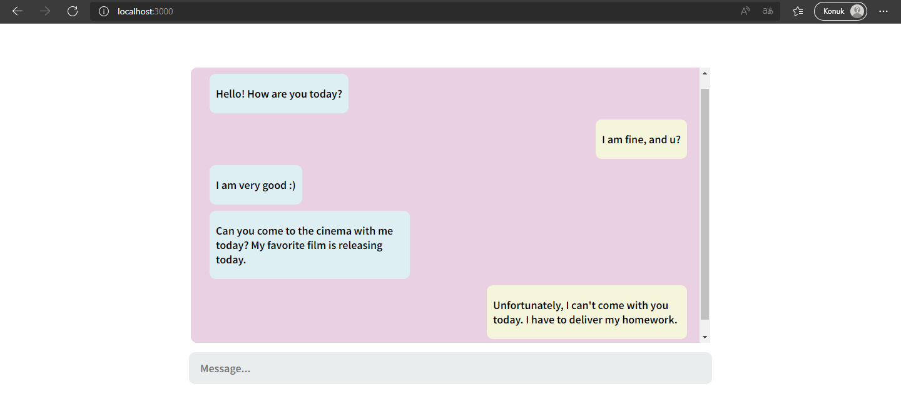

# CHAT APP 

This is a real-time chat application. The connection to the Socket Server is provided by the client with the socket.io-client module. Instantly sent and received messages are shown to the users in this application. As the messages arrive, the page is automatically scrolled down.




## Used Technologies
* 

* 

* 

## Installation
First clone the project.
```
git clone https://github.com/saglamburcu/react-chat-app.git
```

## Usage
After cloning the project, open it in Visual Studio Code.
```
cd react-chat-app
code .
```
Download node modules to make it work
```
npm install
```
To make it work
```
npm start
```